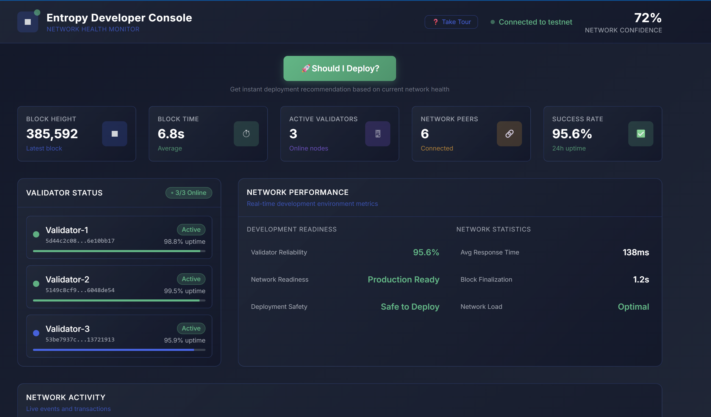

# Entropy Developer Console

Desktop application for monitoring Entropy testnet health and getting deployment recommendations.



## Features

- Real-time network monitoring
- Validator status tracking  
- Deployment safety analysis
- Network confidence scoring
- Live activity feed

## Download

Download the latest release for your platform from the [Releases](../../releases) page.

## Development

### Prerequisites
- Rust
- Node.js

### Build

```bash
# Install dependencies
npm install

# Development mode
npm run dev

# Build for production
npm run build

# Cross-compile for Windows (from Linux)
cargo tauri build --target x86_64-pc-windows-gnu
```

## Usage

1. Launch the application
2. Wait for connection to Entropy testnet
3. Monitor network health metrics
4. Click "Should I Deploy?" for deployment recommendations
5. Click validators for detailed information

## Network

Connects to: `wss://testnet.entropy.xyz`

---

Built with [Tauri](https://tauri.app)
